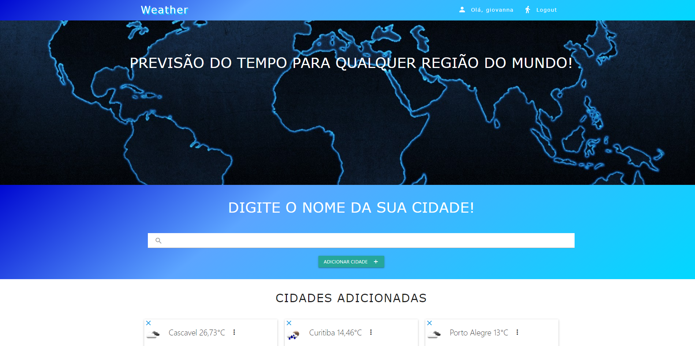
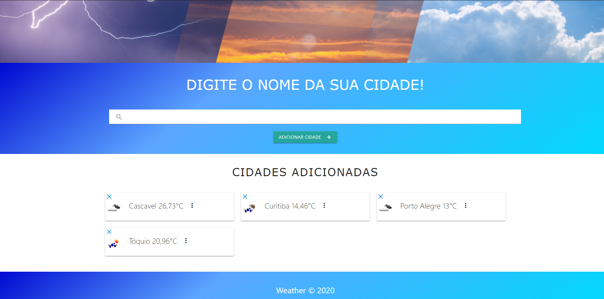
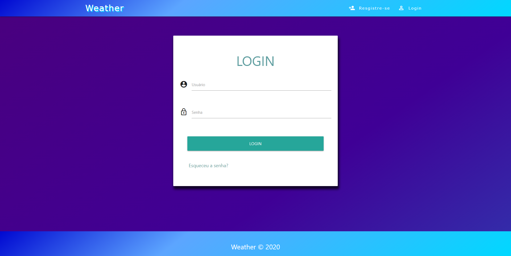
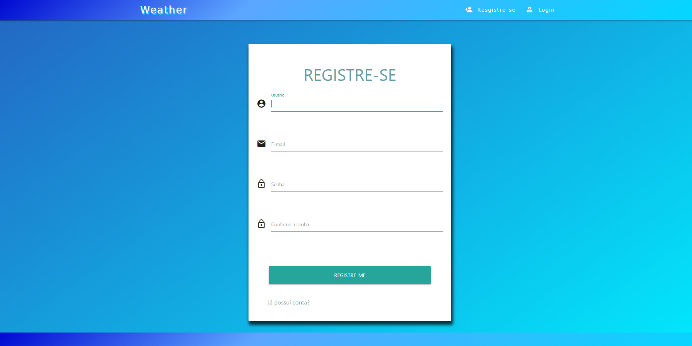
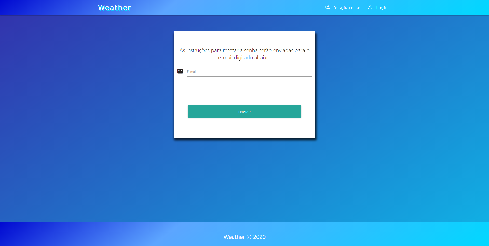

# Weather-app-django

## See preview here: https://weather-app-service1.herokuapp.com/
---











---

### Table of Contents
Find yourself here

- [Description](#description)
- [How To Use](#how-to-use)
- [License](#license)
- [Author Info](#author-info)
- [Features](#Features)

---

## Description
Weather app consuming Open Weather api with user authentication, the goal of this project is shows weather forecast to anywhere around the world.

## Technologies

### Database
- PostgreSQL
### Backend
- Python
- Django framework(function-based-views)
### Frontend
- HTML5
- CSS3
- Materialize css
- SASS

---
## Features

### User Registration
- username
- email
- password
- confirm password


### User authentication
- it is possible to authenticate the user using username and password

### Forgot password
- You can recover your access typing your e-mail used when you register

### Add Cities
- You can add as many cities as you like to know the daily weather forecast like minimum temperature, maximum temperature, atmospheric pressure,
humidity and wind speed

---

## How To Use

### Run locally
#### Use at least python 3.8.3 version
### Clone the project

```html
git clone https://github.com/GiovannaK/Weather-app-django.git
```
### Create and start a virtual environment

#### Windows
```html
python -m venv venv

venv\Scripts\activate.bat

python -m pip install --upgrade pip setuptools wheel --user

pip install -r requirements.txt

python manage.py migrate
```

#### Linux

```html
python3 -m venv venv

. venv/bin/activate

pip install -r requirements.txt

python manage.py migrate
```

#### MAC

```html
python -m venv venv

. venv/bin/activate

pip install -r requirements.txt

python manage.py migrate
```

### Database

#### Create a postgres database and add the credentials to settings.py

```html
DATABASES = {
    'default': {
        'ENGINE': 'django.db.backends.postgresql_psycopg2',
        'NAME': 'db_name',
        'USER': 'name',
        'PASSWORD': '',
        'HOST': 'localhost',
        'PORT': '',
    }
}
```
### S3 bucket was used to store static files and images you can create an account in AWS, create a bucket and setup the credentials in settings.py

```html
AWS_ACCESS_KEY_ID = config('AWS_ACCESS_KEY_ID')
AWS_SECRET_ACCESS_KEY = config('AWS_SECRET_ACCESS_KEY')
AWS_STORAGE_BUCKET_NAME = config('AWS_STORAGE_BUCKET_NAME')
AWS_S3_FILE_OVERWRITE = False
AWS_DEFAULT_ACL = None
DEFAULT_FILE_STORAGE = 'storages.backends.s3boto3.S3Boto3Storage'
STATICFILES_STORAGE = 'storages.backends.s3boto3.S3Boto3Storage'

STATIC_URL = 'http://' + AWS_STORAGE_BUCKET_NAME + '.s3.amazonaws.com/'
ADMIN_MEDIA_PREFIX = STATIC_URL + 'admin/'
```
### If you don't want to use the S3 bucket, delete the credentials, remove ADMIN_MEDIA_PREFIX and change STATIC_URL to 

```html
STATIC_URL = '/static/'
```
### Generate a secret key and add to settings.py
---
### You can use this link to generate your secret key
#### https://miniwebtool.com/django-secret-key-generator/
---
### Run this command to migrate your database

```html
python manage.py migrate
```
### Run this to create an admin account

```html
python manage.py createsuperuser
```
### Start the development server in localhost:8000

```html
python manage.py runserver

```


---


## License

MIT License

Copyright (c) [2021]

Permission is hereby granted, free of charge, to any person obtaining a copy
of this software and associated documentation files (the "Software"), to deal
in the Software without restriction, including without limitation the rights
to use, copy, modify, merge, publish, distribute, sublicense, and/or sell
copies of the Software, and to permit persons to whom the Software is
furnished to do so, subject to the following conditions:

The above copyright notice and this permission notice shall be included in all
copies or substantial portions of the Software.

THE SOFTWARE IS PROVIDED "AS IS", WITHOUT WARRANTY OF ANY KIND, EXPRESS OR
IMPLIED, INCLUDING BUT NOT LIMITED TO THE WARRANTIES OF MERCHANTABILITY,
FITNESS FOR A PARTICULAR PURPOSE AND NONINFRINGEMENT. IN NO EVENT SHALL THE
AUTHORS OR COPYRIGHT HOLDERS BE LIABLE FOR ANY CLAIM, DAMAGES OR OTHER
LIABILITY, WHETHER IN AN ACTION OF CONTRACT, TORT OR OTHERWISE, ARISING FROM,
OUT OF OR IN CONNECTION WITH THE SOFTWARE OR THE USE OR OTHER DEALINGS IN THE
SOFTWARE.


---

## Author Info

abdur rakib mollah


